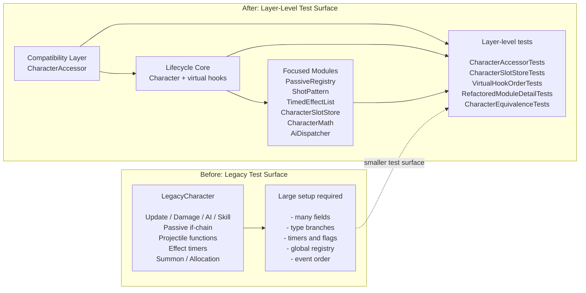

# 레거시 C++ 게임 Character 시스템 리팩토링 예제

이 저장소는 레거시 스타일의 C++ 게임 Character 시스템을 개선한 예제입니다.
포트폴리오와 학습 목적으로 새로 작성한 샘플 코드이며, 실제 상용 프로젝트의 소스 코드나 데이터를 포함하지 않습니다.

샘플은 같은 toy 동작을 두 가지 구조로 구현합니다.

- `src/legacy`: 하나의 `LegacyCharacter` 클래스에 책임이 집중된 구조
- `src/refactored`: 접근, 생성, 업데이트, 계산, 타이밍 책임을 분리한 구조

실제 회사명, 게임명, 내부 클래스명, 함수명, 변수명, 도메인명, 캐릭터명, 스킬명, 보스명, 서버명, 패킷명, 테이블명은 사용하지 않았습니다.
게임 규칙과 수치도 실제 구현과 무관한 toy 값으로 작성했습니다.

## 개요

레거시 버전은 Character 관련 동작 대부분을 하나의 클래스에 둡니다.
전역 배열 스타일 접근, 타입 분기, 내부 유틸리티 함수, 상태 업데이트 로직이 `LegacyCharacter` 안에 함께 들어 있습니다.

개선 버전은 외부에서 관찰되는 toy 동작을 유지하면서 구조를 나눕니다.
접근 계층, 기본 생명주기, 타입별 hook, 재사용 슬롯, stateless helper, passive handler, shot pattern, effect timer tracker를 분리했습니다.

테스트는 두 구현의 state snapshot과 event trace를 비교합니다.

## 문제 구조

레거시 샘플은 오래된 C++ 게임 클라이언트에서 볼 수 있는 "거대한 Character 클래스" 문제를 설명하기 위해 만든 synthetic example입니다.
기능이 추가될수록 하나의 Character 클래스에 책임이 계속 누적되는 상황을 toy rule로 재구성했습니다.

이 예제의 `LegacyCharacter`는 다음 책임을 함께 가집니다.

- 캐릭터 초기화와 업데이트
- 이동과 공격
- 데미지와 사망 처리
- AI 상태 처리
- 스킬 쿨다운 처리
- 타입별 분기
- passive 실행 타이밍 분기
- 소환과 회수 처리
- projectile 동작
- 상태이상 timer 상태
- effect trigger와 sound trigger
- return-request 처리
- 간단한 계산 함수
- 일부 new/delete 기반 임시 객체 관리

이 구조에서는 변경 범위를 분리하기 어렵습니다.
새 캐릭터 타입을 추가할 때 기존 타입을 처리하던 메서드 본문에 조건문을 계속 추가해야 합니다.
특정 동작만 테스트하려고 해도 관련 없는 Character 상태를 함께 준비해야 합니다.

`LegacyCharacter.h`에는 `skillCooldownA`, `skillCooldownB`, `passiveFlagA`, `poisonTimer`, `stunTimer`, `summonLifeTime` 같은 상태가 직접 추가되어 있습니다.
새 기능이 들어올 때 별도 소유자를 만들지 않고 Character 멤버를 계속 늘리는 구조를 표현했습니다.

`LegacyCharacter.cpp`에는 `ProcessAI`, `CastSkill`, `ApplyPassiveEffects`, `CreateStraightProjectile`, `CreateMultiProjectile`, `SummonUnit`, `CleanupSummon` 같은 함수가 같은 클래스에 들어 있습니다.
각 함수는 toy rule만 사용하지만, 타입 분기와 중복된 예외 처리가 늘어나는 형태를 의도적으로 남겨 두었습니다.

전역 포인터 배열인 `gCharacters`도 포함했습니다.
이 배열은 기존 호출부 호환성을 표현하기 위한 장치이며, index 접근과 lifetime 관리가 분산되는 문제를 보여줍니다.

## 리팩토링 목표

개선 버전은 toy 동작을 비교 가능하게 유지하면서 구조를 바꿉니다.

- `CharacterAccessor`가 배열 스타일 Character 접근을 감쌉니다.
- `Character`가 공통 생명주기 순서를 관리합니다.
- 파생 Character 클래스가 타입별 hook 동작을 처리합니다.
- `CharacterFactory`가 구체 Character 타입을 생성합니다.
- `CharacterSlotStore`가 재사용 가능한 Character 슬롯을 관리합니다.
- `CharacterMath`가 상태를 갖지 않는 계산 함수를 제공합니다.
- `PassiveRegistry`가 실행 타이밍별 passive handler를 실행합니다.
- `ShotPattern` 객체가 projectile 변형을 처리합니다.
- `TimedEffectList`가 effect duration과 expiration event를 관리합니다.
- `ReturnRequestModule`이 return-request event를 처리합니다.

구현은 C++17과 표준 라이브러리만 사용합니다.
외부 라이브러리, 복잡한 템플릿 코드, 실제 게임 도메인 로직은 넣지 않았습니다.

## 구조 비교

```text
Before

gCharacters[index] / LegacyRegistry[index]
  -> LegacyCharacter
       -> Initialize / Update / ApplyDamage / Die
       -> Move / Attack / ProcessAI
       -> CastSkill / UpdateSkillTimers
       -> ApplyPassiveEffects if-chain
       -> SummonUnit / RecallUnit / CleanupSummon
       -> CreateStraightProjectile / CreateMultiProjectile
       -> poisonTimer / stunTimer / burnTimer / shieldTimer
       -> skillCooldownA / passiveFlagA / passiveCounterB
       -> local utility calculations
       -> scattered new/delete
```

```text
After

CharacterAccessor[index]
  -> Character
       -> fixed lifecycle order
       -> virtual hooks
       -> TimedEffectList
       -> PassiveRegistry
       -> ShotPattern
       -> ReturnRequestModule
       -> AiDispatcher

CharacterFactory
  -> concrete Character type

CharacterSlotStore
  -> reusable ownership slots
```

| 문제 | Legacy 예제 | Refactored 예제 |
| --- | --- | --- |
| 접근 | `gCharacters[index]`, `LegacyRegistry[index]` | `CharacterAccessor` |
| 생성 | 여러 함수 안에서 직접 처리 | `CharacterFactory` |
| 재사용 | 호출 위치마다 정책이 흩어짐 | `CharacterSlotStore` |
| 생명주기 | `Update()` 안에 여러 책임이 섞임 | `Character` base lifecycle |
| 타입별 차이 | `switch` / `if-chain` | virtual hook |
| 계산 | `LegacyCharacter` 내부 함수 | `CharacterMath` |
| passive | 시점과 조건이 한 함수에 섞임 | `PassiveRegistry` |
| projectile | 여러 생성 함수가 Character 안에 있음 | `ShotPattern` |
| effect timer | Character 멤버로 직접 보관 | `TimedEffectList` |
| 소환/회수 | 타입별 예외가 같은 함수에 섞임 | 독립 모듈로 분리 가능한 대상 |

## 실제 모듈 기준 설명

이 저장소는 모든 legacy 함수를 refactored 쪽에 1:1로 완전 포팅한 예제가 아닙니다.
`legacy/`는 구조적 문제를 보여주는 synthetic example이고, `refactored/`는 그 문제를 어떤 모듈 경계로 나눌 수 있는지 보여주는 샘플입니다.

```text
LegacyCharacter
  |
  |-- global access risk
  |     -> CharacterAccessor
  |
  |-- creation mixed with gameplay
  |     -> CharacterFactory
  |
  |-- reuse and lifetime scattered
  |     -> CharacterSlotStore
  |
  |-- update order mixed with type branches
  |     -> Character base lifecycle + virtual hooks
  |
  |-- small calculations inside Character
  |     -> CharacterMath
  |
  |-- passive if-chain
  |     -> PassiveRegistry
  |
  |-- projectile creation branches
  |     -> ShotPattern
  |
  |-- effect timer fields
  |     -> TimedEffectList
  |
  |-- return-request branch
  |     -> ReturnRequestModule
  |
  |-- AI branch inside Update
        -> AiDispatcher
```

| Refactored 모듈 | 실제 파일 | 담당 책임 |
| --- | --- | --- |
| `CharacterAccessor` | `src/refactored/CharacterAccessor.*` | 배열 스타일 접근을 감싸고 invalid index, empty slot 접근을 검사합니다. |
| `Character` | `src/refactored/Character.*` | `Initialize`, `Update`, `ApplyDamage`, `Die`의 실행 순서를 고정합니다. |
| `CharacterFactory` | `src/refactored/CharacterFactory.*` | `CharacterKind`에 맞는 구체 Character 타입을 생성합니다. |
| `CharacterSlotStore` | `src/refactored/CharacterSlotStore.*` | acquire/release 상태와 재사용 가능한 슬롯을 관리합니다. |
| `CharacterMath` | `src/refactored/CharacterMath.*` | damage clamp, projectile count, snapshot 생성 같은 stateless 계산을 담당합니다. |
| `PassiveRegistry` | `src/refactored/Passive/PassiveRegistry.*` | `OneShot`, `Passive`, `PostPassive`, `Dying` 타이밍별 handler를 실행합니다. |
| `ShotPattern` | `src/refactored/Projectile/ShotPattern.*` | straight, multi-shot, directional, sector, homing projectile branch를 strategy로 분리합니다. |
| `TimedEffectList` | `src/refactored/Effects/TimedEffectList.*` | effect duration 감소와 expiration event 생성을 담당합니다. |
| `ReturnRequestModule` | `src/refactored/Return/ReturnRequestModule.*` | return-request 관련 event 처리를 Character 밖으로 분리합니다. |
| `AiDispatcher` | `src/refactored/AI/AiDispatcher.*` | AI 실행 지점을 Character lifecycle 안의 별도 collaborator로 둡니다. |
| `SimpleMemoryPool` | `src/refactored/Memory/SimpleMemoryPool.h` | gameplay object와 allocation policy를 분리하는 작은 free-list 예제입니다. |

refactored 쪽은 단순히 파일만 나눈 구조가 아닙니다.
각 모듈이 자기 책임을 설명하는 작은 타입과 query API를 갖습니다.

- `CharacterAccessor`: `TryGet`, `IsValidIndex`, `IsOccupied`, `Clear`
- `CharacterSlotStore`: `Contains`, `AvailableCount`, `InUseCount`
- `TimedEffectList`: `TimedEffect`, `HasBlockingEffect`, `RemainingFrames`
- `PassiveRegistry`: `PassiveHandler`, `PassiveExecutionContext`, `HandlerCount`
- `ShotPattern`: `ShotRequest`, `ShotSpawn`, `ShotPlan`, `BuildPlan`
- `AiDispatcher`: `AiDecision`, `AiIntent`, `Decide`
- `SkillExecutor`: `CanExecute`, `StartCooldown`, `SkillRuntimeState`

이 차이 때문에 legacy 쪽은 “하나의 클래스 안에서 모든 것을 직접 처리하는 예제”로 보이고, refactored 쪽은 “책임을 가진 작은 모듈들이 협력하는 예제”로 보입니다.

예를 들어 legacy 쪽 `ApplyPassiveEffects()`는 실행 시점, 캐릭터 타입, skill 상태, hp 조건이 한 함수에 섞여 있습니다.
refactored 쪽에서는 `PassiveRegistry`가 실행 타이밍을 기준으로 handler를 나눕니다.

legacy 쪽 `CreateStraightProjectile()`, `CreateMultiProjectile()`, `CreateDirectionalProjectile()`, `CreateHomingProjectile()`는 좌표와 방향 계산을 각 함수에 반복해서 둡니다.
refactored 쪽에서는 `ShotPattern` 구현체가 projectile 변형을 담당합니다.

legacy 쪽 `Update()`는 AI, timer, passive, projectile, summon cleanup, event 순서를 한 번에 처리합니다.
refactored 쪽에서는 `Character`가 lifecycle 순서를 고정하고, 세부 책임은 collaborator로 넘깁니다.

```text
Legacy update shape

LegacyCharacter::Update()
  -> ProcessAI()
  -> Move()
  -> UpdateSkillTimers()
  -> UpdateStatusTimers()
  -> ApplyPassiveEffects()
  -> FireProjectile()
  -> TryReturnRequest()
  -> CleanupSummon()
  -> DeleteOldProjectiles()

Refactored update shape

Character::Update()
  -> OnPreUpdate()
  -> AiDispatcher::Decide()/Dispatch()
  -> TimedEffectList::Update()
  -> PassiveRegistry::Execute()
  -> ShotPattern::BuildPlan()/Emit()
  -> ReturnRequestModule::TryReturnRequest()
  -> OnPostUpdate()
```

## 테스트 가능한 경계

이 구조의 목적은 클래스를 나누어 테스트 주도형 개발이 가능한 경계를 만드는 것입니다.

레거시 구조에서는 하나의 동작을 확인할 때도 `LegacyCharacter` 전체 상태와 전역 registry를 준비해야 합니다.
개선 구조에서는 접근, 재사용, lifecycle, passive, shot, effect, AI, skill을 각각 작은 단위로 테스트할 수 있습니다.



| Test | Target | Legacy issue | Refactored benefit |
| --- | --- | --- | --- |
| `CharacterAccessorTests` | access boundary | raw index access was scattered | invalid index and empty slot checks are isolated |
| `CharacterSlotStoreTests` | lifetime/reuse | allocation policy was mixed with gameplay | acquire/release behavior is tested directly |
| `VirtualHookOrderTests` | lifecycle order | update order was hidden inside one method | base lifecycle order is explicit |
| `RefactoredModuleDetailTests` | module boundaries | passive/timer/shot/AI state lived near Character | modules expose small independent APIs |
| `CharacterEquivalenceTests` | behavior preservation | refactoring can change state or event order | snapshot and event trace are compared |

`CharacterAccessorTests`는 접근 계층을 검증합니다.
`CharacterSlotStoreTests`는 객체 재사용 정책을 검증합니다.
`VirtualHookOrderTests`는 base lifecycle 순서를 검증합니다.
`RefactoredModuleDetailTests`는 passive, shot, effect, AI, skill 모듈이 독립 API를 갖는지 검증합니다.
`CharacterEquivalenceTests`는 legacy와 refactored가 같은 toy 입력에서 같은 snapshot과 event trace를 내는지 검증합니다.

## 주요 변경점

### 전역 접근에서 CharacterAccessor로 분리

레거시 샘플은 배열 스타일 registry를 통해 Character에 접근합니다.
개선 버전은 호출부와 저장된 Character 포인터 사이에 `CharacterAccessor`를 둡니다.

`CharacterAccessor::operator[]`는 배열과 비슷한 접근 문법을 유지합니다.
동시에 잘못된 index 접근과 비어 있는 slot 접근을 접근 계층에서 검사합니다.

### 거대한 Character 클래스에서 Character 계층으로 분리

레거시 샘플은 공통 동작과 타입별 동작을 하나의 클래스에서 처리합니다.
개선 버전은 `Character`를 base class로 두고 공통 생명주기를 관리합니다.

`PlayerCharacter`, `MonsterCharacter`, `SummonCharacter`, `EliteMonsterCharacter` 같은 구체 타입은 좁은 hook만 override합니다.
생명주기 순서는 base class에 남겨 둡니다.

### 타입 분기에서 virtual hook으로 변경

레거시 update 경로는 `LegacyCharacter` 내부에서 타입을 확인합니다.
개선 버전은 base lifecycle이 virtual hook을 호출합니다.

새 타입의 동작은 파생 클래스에 추가할 수 있습니다.
기존 update 메서드의 큰 `switch` 본문을 계속 늘리지 않아도 됩니다.

### 생성 책임과 재사용 책임 분리

`CharacterFactory`는 구체 Character 객체를 만들고 기본 collaborator를 연결합니다.
`CharacterSlotStore`는 acquire/release 상태와 slot 재사용을 관리합니다.

생성 방식과 재사용 정책을 분리하면 테스트 범위도 분리됩니다.
slot capacity, acquire, release, reuse 동작을 별도로 확인할 수 있습니다.

### 내부 유틸리티 함수에서 stateless helper로 분리

간단한 계산 함수는 `CharacterMath`로 이동했습니다.
이 함수들은 Character 상태를 저장하지 않습니다.

계산 로직은 Character 생명주기 setup 없이 테스트할 수 있습니다.

### passive 분기에서 handler registry로 분리

레거시 샘플은 passive 동작을 timing branch로 실행합니다.
개선 버전은 `PassiveRegistry`에 handler를 등록하고 timing별로 실행합니다.

사용한 timing은 다음과 같습니다.

- `OneShot`
- `Passive`
- `PostPassive`
- `Dying`

실행 위치는 Character lifecycle 안에서 명시적으로 관리합니다.

### projectile 함수에서 shot strategy로 분리

projectile 변형은 `ShotPattern` 구현체로 표현했습니다.
샘플에는 straight, multi-shot, directional, sector, homing pattern이 있습니다.

각 pattern은 generic toy event만 발생시킵니다.
실제 projectile 규칙은 구현하지 않았습니다.

### effect timer를 TimedEffectList로 분리

레거시 샘플은 effect timer 상태를 `LegacyCharacter`가 직접 보관합니다.
개선 버전은 duration 저장과 expiration event 생성을 `TimedEffectList`로 이동했습니다.

`Character`는 update 중 tracker를 호출합니다.
timer 상태 변경과 만료 event 생성은 tracker가 담당합니다.

### allocation policy 예제 분리

`SimpleMemoryPool`은 단순 free-list 예제입니다.
gameplay object 밖에서 allocation policy를 관리하는 형태를 보여주기 위해 포함했습니다.

이 memory pool은 production allocator가 아닙니다.

## 동치 보존 전략

이 샘플은 구조 변경 후에도 외부 관찰 결과가 유지되는지 확인합니다.

개선 버전의 lifecycle은 toy operation 순서를 고정합니다.

```text
Initialize
OneShot passive
PreUpdate event
type hook
effect update
Passive timing
shot pattern
return-request handling
PostPassive timing
PostUpdate hook
Updated event
damage
Dying passive
death event
```

테스트는 다음 결과를 비교합니다.

- state snapshot
- event trace
- accessor failure behavior
- reusable slot behavior
- virtual hook call order

실제 마이그레이션에서는 log order, effect trigger order, random call order, frame timing read도 확인 대상이 됩니다.

## 테스트

테스트는 C++ 표준 라이브러리와 `assert`만 사용합니다.
외부 테스트 프레임워크는 필요하지 않습니다.

테스트 파일은 다음과 같습니다.

- `CharacterEquivalenceTests.cpp`: legacy와 refactored의 snapshot, event trace 비교
- `CharacterAccessorTests.cpp`: 정상 접근, invalid index, empty slot 접근 확인
- `CharacterSlotStoreTests.cpp`: acquire, release, capacity, reuse 확인
- `VirtualHookOrderTests.cpp`: lifecycle hook 호출 순서 확인

빌드와 테스트 실행:

```bash
cmake -S . -B build
cmake --build build --config Debug
ctest --test-dir build -C Debug --output-on-failure
```

## 저장소 구조

```text
docs/
  01_legacy_problem.md
  02_refactoring_strategy.md
  03_architecture_overview.md
  04_behavior_preserving_refactoring.md
  05_risk_and_limitations.md
  06_public_release_checklist.md
src/
  legacy/
  refactored/
tests/
```

## 한계

이 저장소는 toy project입니다.

포함하지 않는 항목은 다음과 같습니다.

- 실제 상용 프로젝트 소스 코드
- 실제 게임 데이터
- 네트워크 코드
- 스크립트 연동
- asset loading
- content table parsing
- 실제 combat, skill, AI 규칙
- production memory management

샘플 코드는 작은 숫자와 generic event 이름만 사용합니다.

## 보안 및 익명화 원칙

이 저장소는 일반화된 리팩토링 경험을 바탕으로 새로 작성했습니다.
회사 소스 코드나 내부 프로젝트 자료를 포함하지 않습니다.

다음 항목은 제외하거나 일반화했습니다.

- 회사명
- 게임명
- 내부 프로젝트명
- 실제 클래스명, 함수명, 변수명, 파일명
- 캐릭터명, 스킬명, 보스명, 아이템명, 지역명, 서버명, 패킷명, 테이블명
- 실제 알고리즘, 수치 튜닝, 데이터 포맷, 운영 규칙
- 내부 주석, 경로, 로그 메시지, 스크린샷, 소스 히스토리
