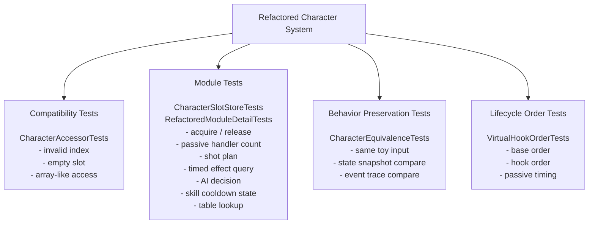

# 03. Architecture Overview / 아키텍처 개요

이 문서는 현재 저장소에 실제로 들어 있는 모듈을 기준으로 구조를 설명한다.
`legacy/`는 문제를 보여주는 synthetic example이고, `refactored/`는 책임을 어떤 경계로 나눌 수 있는지 보여주는 샘플이다.

This document explains the structure based on modules that actually exist in this repository.
`legacy/` is a synthetic example that shows the problem shape, and `refactored/` shows how the responsibilities can be split into boundaries.

## Legacy View / 레거시 구조

```text
gCharacters[index] / LegacyRegistry[index]
  -> LegacyCharacter
       -> Initialize / Update / ApplyDamage / Die
       -> Move / Attack / ProcessAI
       -> CastSkill / UpdateSkillTimers
       -> ApplyPassiveEffects
       -> CreateStraightProjectile / CreateMultiProjectile / CreateSectorProjectile
       -> SummonUnit / RecallUnit / CleanupSummon
       -> poisonTimer / stunTimer / burnTimer / shieldTimer / silenceTimer
       -> skillCooldownA~E / skillCostA~D / skillPowerA~D
       -> passiveFlagA~E / passiveCounterA~E
       -> local utility calculations
       -> scattered new/delete
```

이 구조에서는 접근, 생성, 실행 순서, 타입별 예외, 상태 timer, 계산 로직이 `LegacyCharacter` 안에 함께 들어간다.
새 기능을 넣을 때 기존 함수 본문에 조건문과 상태 멤버가 계속 추가되는 형태를 만든다.

In this shape, access, creation, execution order, type-specific exceptions, state timers, and calculation logic all live inside `LegacyCharacter`.
Adding a feature tends to add more conditions and state fields to existing function bodies.

## Refactored View / 개선 구조

```text
CharacterAccessor[index]
  -> Character
       -> Initialize
       -> Update
          -> OnPreUpdate hook
          -> AiDispatcher
          -> TimedEffectList
          -> PassiveRegistry
          -> ShotPattern
          -> ReturnRequestModule
          -> OnPostUpdate hook
       -> ApplyDamage
       -> Die

CharacterFactory
  -> concrete Character type
  -> default PassiveRegistry
  -> default ShotPattern

CharacterSlotStore
  -> acquired/released object slots
```

`Character`는 생명주기 순서를 잡고, 세부 책임은 collaborator에 넘긴다.
타입별 차이는 파생 클래스 hook 또는 독립 모듈에서 처리한다.

`Character` owns the lifecycle order, and detailed responsibilities are delegated to collaborators.
Type-specific differences are handled by derived hooks or independent modules.

## Module Responsibility Map / 모듈 책임표

| Module / 모듈 | File / 파일 | Responsibility / 책임 |
| --- | --- | --- |
| `CharacterAccessor` | `src/refactored/CharacterAccessor.*` | 배열 스타일 접근을 유지하면서 index와 empty slot을 검사한다. / Keeps array-style access while checking indexes and empty slots. |
| `Character` | `src/refactored/Character.*` | initialize, update, damage, death 순서를 고정한다. / Fixes initialize, update, damage, and death order. |
| `CharacterFactory` | `src/refactored/CharacterFactory.*` | `CharacterKind`에 맞는 concrete type과 기본 collaborator를 만든다. / Creates the concrete type and default collaborators for a `CharacterKind`. |
| `CharacterSlotStore` | `src/refactored/CharacterSlotStore.*` | acquire/release 상태와 reusable slot을 관리한다. / Manages acquire/release state and reusable slots. |
| `CharacterMath` | `src/refactored/CharacterMath.*` | damage clamp, projectile count, snapshot 생성 같은 stateless 계산을 담당한다. / Owns stateless calculations such as damage clamp, projectile count, and snapshot creation. |
| `CharacterTuningTable` | `src/refactored/Data/CharacterTuningTable.*` | Character 종류별 tuning 값을 code-level table로 모은다. / Collects character-kind tuning values into a code-level table. |
| `SkillDefinitionTable` | `src/refactored/Data/SkillDefinitionTable.*` | skill id, cooldown, cost, power 값을 data object로 조회한다. / Looks up skill id, cooldown, cost, and power through data objects. |
| `PassiveRegistry` | `src/refactored/Passive/PassiveRegistry.*` | passive handler를 `PassiveTiming`별로 실행한다. / Executes passive handlers by `PassiveTiming`. |
| `ShotPattern` | `src/refactored/Projectile/ShotPattern.*` | projectile 생성 분기를 strategy object로 나눈다. / Splits projectile creation branches into strategy objects. |
| `TimedEffectList` | `src/refactored/Effects/TimedEffectList.*` | effect duration 감소와 expiration event 생성을 담당한다. / Owns effect duration updates and expiration events. |
| `ReturnRequestModule` | `src/refactored/Return/ReturnRequestModule.*` | return-request 관련 처리를 Character 밖으로 분리한다. / Moves return-request handling out of Character. |
| `AiDispatcher` | `src/refactored/AI/AiDispatcher.*` | AI 실행 지점을 별도 collaborator로 둔다. / Keeps the AI execution point in a separate collaborator. |
| `SimpleMemoryPool` | `src/refactored/Memory/SimpleMemoryPool.h` | allocation policy를 gameplay object 밖으로 분리하는 예제를 제공한다. / Shows allocation policy outside gameplay objects. |

## Module Detail / 모듈 세부 설명

refactored 쪽은 각 모듈이 작지만 자기 책임을 드러내는 타입과 query API를 갖는다.

The refactored side keeps modules small, but each module exposes types and query APIs that show its responsibility.

| Module / 모듈 | Added detail / 추가된 형태 | Why it matters / 의미 |
| --- | --- | --- |
| `CharacterAccessor` | `TryGet`, `IsValidIndex`, `IsOccupied`, `Clear` | raw array access를 호출부마다 직접 검사하지 않게 한다. / Avoids repeated raw array checks at each call site. |
| `CharacterSlotStore` | `Contains`, `AvailableCount`, `InUseCount` | lifetime과 reuse 상태를 테스트 가능한 값으로 만든다. / Makes lifetime and reuse state testable. |
| `TimedEffectList` | `TimedEffect`, `HasBlockingEffect`, `RemainingFrames` | timer field가 Character에 계속 늘어나는 문제를 줄인다. / Reduces timer field growth inside Character. |
| `PassiveRegistry` | `PassiveHandler`, `PassiveExecutionContext`, `HandlerCount` | passive if-chain을 timing과 handler 단위로 볼 수 있게 한다. / Turns passive if-chains into timing and handler units. |
| `ShotPattern` | `ShotRequest`, `ShotSpawn`, `ShotPlan`, `BuildPlan` | projectile 계산과 event emission을 분리할 수 있게 한다. / Separates projectile calculation from event emission. |
| `AiDispatcher` | `AiIntent`, `AiDecision`, `Decide` | AI branch를 update 본문 밖에서 판단할 수 있게 한다. / Allows AI decisions outside the update body. |
| `SkillExecutor` | `SkillRuntimeState`, `CanExecute`, `StartCooldown` | skill cooldown과 실행 가능 여부를 Character 멤버에서 분리하는 방향을 보여준다. / Shows how cooldown and executable state can move out of Character fields. |
| `CharacterTuningTable` | `CharacterTuning`, `FindCharacterTuning` | 타입별 tuning 값을 계산 함수 밖에서 조회한다. / Looks up type tuning values outside calculation functions. |
| `SkillDefinitionTable` | `SkillDefinition`, `FindSkillDefinition`, `ToSkillData` | skill id 기반 값을 `SkillData`로 변환한다. / Converts skill id based values into `SkillData`. |

```text
Legacy field accumulation

LegacyCharacter
  skillCooldownA_
  skillCooldownB_
  passiveFlagA_
  poisonTimer_
  stunTimer_
  burnTimer_
  shieldTimer_
  projectiles_
  summon_

Refactored ownership direction

SkillRuntimeState        -> Skill/
PassiveHandler          -> Passive/
TimedEffect             -> Effects/
ShotPlan, ShotSpawn     -> Projectile/
CharacterSlotStore      -> object reuse
CharacterTuningTable    -> code-level tuning rows
SkillDefinitionTable    -> code-level skill rows
```

## Data Object Step / Data Object 단계

이 샘플은 모든 값을 외부 파일로 분리하지 않는다.
먼저 code-level table과 data object로 값을 모으는 단계를 보여준다.

This sample does not move every value into an external file.
It first collects values into code-level tables and data objects.

```text
Legacy shape

LegacyCharacter::Update()
  energy += value chosen inside a switch
  projectile count = nearby enemy count + type-specific value

LegacyCharacter::CastSkill()
  cooldown and cost are chosen near skill execution code

Refactored shape

CharacterTuningTable
  -> CharacterMath::EnergyGainForKind()
  -> CharacterMath::ProjectileCountForKind()

SkillDefinitionTable
  -> SkillDefinition
  -> SkillData
  -> SkillExecutor
```

이 단계는 table parser를 만드는 작업이 아니다.
분기 안에 흩어진 값을 먼저 같은 형태의 row로 모아, 이후 CSV, script table, binary table, editor-authored data asset으로 옮길 수 있게 하는 작업이다.

This step is not about building a table parser.
It first collects values scattered inside branches into row-shaped data so they can later move to CSV, script tables, binary tables, or editor-authored data assets.

## Test Surface / 테스트 경계

refactored 구조는 테스트 가능한 경계를 작게 나누는 것을 목표로 한다.
각 테스트는 하나의 레이어 또는 하나의 refactoring risk를 다룬다.

The refactored structure aims to create small testable boundaries.
Each test covers one layer or one refactoring risk.



## Legacy Function to Refactored Boundary / Legacy 함수와 Refactored 경계

| Legacy example / Legacy 예시 | Problem shown / 보이는 문제 | Refactored boundary / 분리 경계 |
| --- | --- | --- |
| `LegacyAt`, `LegacyRawAt`, `gCharacters` | 전역 접근과 index 위험 / global access and index risk | `CharacterAccessor` |
| `Initialize` 안의 registry 등록 | 생성과 접근 상태가 섞임 / creation and access state are mixed | `CharacterFactory`, `CharacterAccessor` |
| `Update` | AI, timer, passive, projectile, return-request가 한 함수에 있음 / AI, timers, passive, projectile, and return-request are in one function | `Character` lifecycle + collaborators |
| `ProcessAI` | 타입별 AI 분기가 Character 안에 있음 / type-specific AI branches are inside Character | `AiDispatcher` |
| `ApplyPassiveEffects` | 시점과 조건이 하나의 if-chain에 섞임 / timing and conditions are mixed in one if-chain | `PassiveRegistry` |
| `Create*Projectile` | projectile 변형마다 좌표 계산이 반복됨 / coordinate calculation repeats per projectile variant | `ShotPattern` |
| `UpdateStatusTimers`, `UpdateEffects` | timer 상태가 Character 멤버로 누적됨 / timer state accumulates as Character fields | `TimedEffectList` |
| `ClampDamage`, `ProjectileCountForKind` | 계산 함수가 Character 내부에 있음 / calculation functions live inside Character | `CharacterMath` |
| type-specific tuning values | 매직넘버가 분기 안에 흩어짐 / magic values are scattered in branches | `CharacterTuningTable` |
| skill id based values | skill 실행 근처에 cooldown, cost 값이 붙음 / cooldown and cost values sit near skill execution | `SkillDefinitionTable` |
| raw projectile/summon allocation | gameplay 함수 안에서 `new/delete`가 직접 호출됨 / gameplay functions call `new/delete` directly | `CharacterSlotStore`, memory boundary |
| `SummonUnit`, `CleanupSummon` | 소유권과 lifetime 처리가 분산됨 / ownership and lifetime handling are scattered | separate module candidate |

## Lifecycle Flow / Lifecycle 흐름

```text
Refactored Character::Update(input)

  PreUpdate event
    |
    v
  OnPreUpdate(input)          // type hook
    |
    v
  AiDispatcher::Dispatch()
    |
    v
  TimedEffectList::Update()
    |
    v
  PassiveRegistry::Execute(Passive)
    |
    v
  ShotPattern::Emit()
    |
    v
  ReturnRequestModule::TryReturnRequest()
    |
    v
  PassiveRegistry::Execute(PostPassive)
    |
    v
  OnPostUpdate(input)         // type hook
    |
    v
  Updated event
```

이 흐름은 legacy `Update()`에 섞여 있던 실행 순서를 base class에 고정하고, 세부 처리를 모듈로 넘기는 구조를 보여준다.

This flow shows how execution order that was mixed inside legacy `Update()` becomes fixed in the base class while detailed behavior moves to modules.
